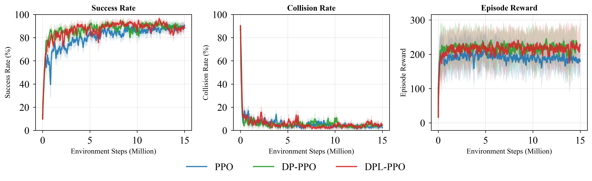
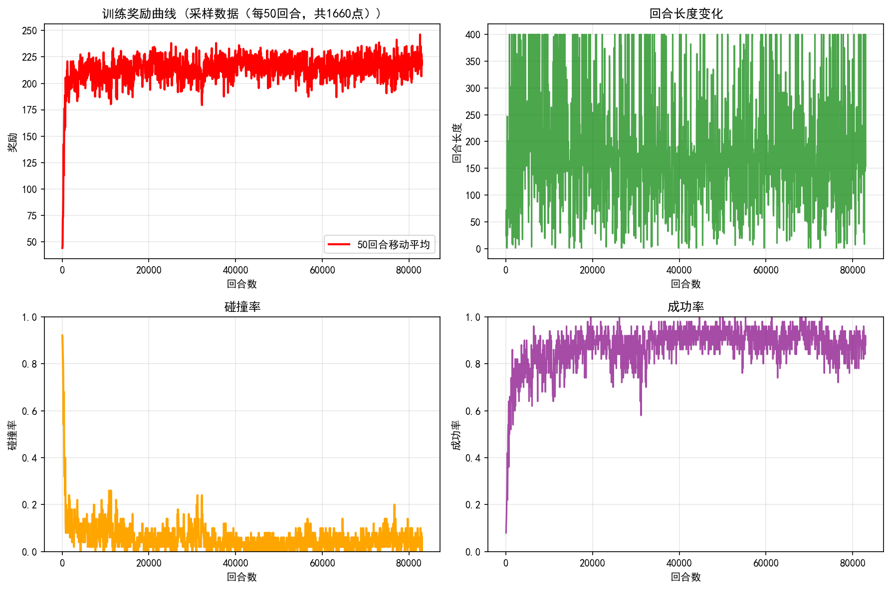

# DPL-PPO: Safe and Efficient Indoor UAV Navigation via Differentiable Physics Guidance and Lagrangian Constraint Optimization

**Liunuoya Yang, Yuanda Wang, Jingyu Liu**  
*School of Automation, Southeast University, Nanjing, China*

---

## Overview

**DPL-PPO** (Differentiable Physics-guided Lagrangian Proximal Policy Optimization) is a PPO variant designed for vision-based indoor UAV navigation in GPS-denied, cluttered environments.

The core idea is to augment standard PPO policy updates with **short-horizon differentiable physics rollouts**. A lightweight point-mass model is unrolled under the current policy to predict near-future states, providing:
- **Auxiliary physics gradients** that encourage feasible, collision-avoiding behavior
- **Trajectory-level violation estimates** for obstacle proximity and dynamic feasibility constraints
- **Adaptive Lagrange multipliers** updated via projected primal–dual ascent

This eliminates the need for manually tuned fixed penalty weights while improving both safety and task completion.

---

## Key Results

### Comparison: DPL-PPO vs. DP-PPO vs. PPO (5 seeds)



DPL-PPO (red) achieves higher success rate (~90%+), lower collision rate, and higher episode reward than vanilla PPO under the same training budget (~15M environment steps).

### DPL-PPO Single-Run Training Progress



The agent quickly converges to a stable success rate above 85% and collision rate below 10%, with episode rewards consistently around 200–230.

---

## Method

### Framework

```
Depth Image ──► CNN Encoder ──►
                               ├──► 140D Observation ──► Actor-Critic
Kinematic State ──────────────►

                    ┌─────────────────────────────────┐
During Update:      │  Short-Horizon Differentiable    │
                    │  Point-Mass Rollout (H steps)    │
                    │  ↓                               │
                    │  Physics Losses + Violation Rates│
                    └─────────────────────────────────┘
                              ↓
              DPL-PPO Objective = PPO Loss
                              + λ_obs  · L_obstacle
                              + λ_feas · L_feasibility
                              + L_smooth + L_energy
```

### Physics Loss Components

| Loss | Description |
|------|-------------|
| $\mathcal{L}_{\text{velocity}}$ | Velocity tracking toward goal |
| $\mathcal{L}_{\text{obstacle}}$ | Soft obstacle avoidance (distance-based) |
| $\mathcal{L}_{\text{smooth}}$ | Control smoothness (jerk penalty) |
| $\mathcal{L}_{\text{energy}}$ | Energy efficiency |
| $\mathcal{L}_{\text{feas}}$ | Dynamic feasibility within acceleration limits |

Lagrange multipliers $\lambda_{\text{obs}}$ and $\lambda_{\text{feas}}$ are updated by projected gradient ascent from rollout violation rates.

---

## Environment

A procedurally generated **PyBullet** indoor arena:

- **Arena**: 30 m × 30 m with 0.2 m wall thickness
- **Obstacles**: Random cylindrical obstacles + permanent corridor walls
- **UAV model**: Fixed-wing planar flight at 1.6 m constant altitude (30 Hz control)
- **Action space**: 2D continuous — thrust $\in [0.5, 1.5]$ + torque $\in [-0.01, 0.01]$
- **Observation space**: 140D — 10D kinematics/goal + 130D depth features (64×64 depth map → CNN → 128D embedding + 2 scalars)
- **Episode**: max 3000 steps; success radius 2.5 m (XY) / 0.5 m (Z)

---

## Repository Structure

```
├── train.py                  # Main training script (DPL-PPO)
├── test.py                   # Model evaluation script
├── batch_test.py             # Batch testing across checkpoints
├── visualize_trajectories.py # Trajectory visualization
├── visualize_indoor_env.py   # Environment visualization
├── extract_tensorboard_metrics.py
│
├── agent/
│   ├── PPOagent.py           # Custom PPO implementation
│   ├── model_SB3/
│   │   ├── leader_phase1_final.zip       # Final trained model
│   │   └── state_norm_params_final.npz   # State normalization parameters
│   └── log_SB3/
│       ├── training_data.json
│       └── training_progress.png
│
└── drone_envs/
    ├── config.py             # Environment configuration
    ├── physics_config.yaml   # Physics parameters
    ├── envs/
    │   └── drone_env_multi.py           # Multi-drone navigation env
    ├── resources/            # PyBullet URDF assets
    └── utils/
        ├── differentiable_simulator.py  # Point-mass differentiable model
        ├── physics_loss.py              # Physics loss calculator
        ├── reward_calculator.py
        ├── observation_manager.py
        ├── state_processor.py
        ├── normalization.py
        ├── environment_manager.py
        ├── camera_manager.py
        └── depth_obstacle_processor.py
```

---

## Training Hyperparameters

| Parameter | Value |
|-----------|-------|
| Learning rate | 3e-4 → 1e-5 (linear decay) |
| n_steps | 2048 |
| batch_size | 64 |
| n_epochs | 10 |
| γ (discount) | 0.99 |
| Control freq. | 30 Hz |
| Seed | 42 |

---

## Getting Started

### Installation

```bash
pip install stable-baselines3 pybullet gym torch numpy
pip install tqdm  # optional, for progress bar
```

### Train

```bash
python train.py
```

### Test

```bash
python test.py
```

The final model is located at `agent/model_SB3/leader_phase1_final.zip` with normalization parameters at `agent/model_SB3/state_norm_params_final.npz`.

---

## Citation

If you find this work useful, please cite:

```bibtex
@article{yang2026dplppo,
  title={DPL-PPO: Safe and Efficient Indoor UAV Navigation via Differentiable Physics Guidance and Lagrangian Constraint Optimization},
  author={Yang, Liunuoya and Wang, Yuanda and Liu, Jingyu},
  institution={Southeast University},
  year={2026}
}
```

---

## Acknowledgements

This implementation builds on [Stable-Baselines3](https://github.com/DLR-RM/stable-baselines3) and [PyBullet-Drones](https://github.com/utiasDSL/gym-pybullet-drones). The differentiable physics module is inspired by [Learning vision-based agile flight via differentiable physics](https://arxiv.org/abs/2407.10648).
